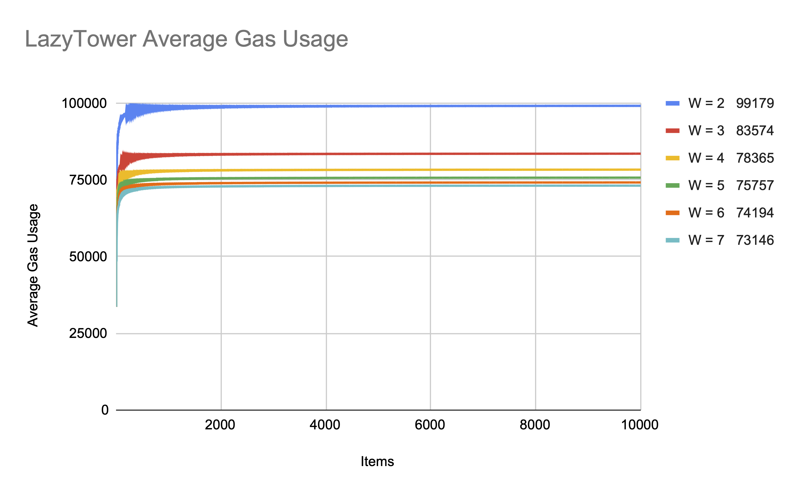

# LazyTower: An O(1) Replacement for Incremental Merkle Trees

(這是草稿版本)

LazyTower 是一個資料結構. 它的用途和 Incremental Merkle Tree (IMT) 一樣: 讓使用者可以逐步地 append items, 並且適用於 zero-knowledge 的 proof of membership.

LazyTower append 一個 item 的 amortized cost 是 O(1).

Proof 的 circuit complexity 是 O(log N). Verification cost 是 O(1).

## 核心觀念

Items 會從最底下的 level 被 append. 如果一層滿了, 就把整層 digest() 起來並 append 到上層. 這樣下層就又有空間可以容納新的 items. 我們以 width = 4 的 tower 為例, 請看影片:

https://www.youtube.com/watch?v=3QeJgxB9ZiQ

藉由儲存
```text
digest([0, 1, 2, 3])
```
這個值, 我們可以在之後證明 item 0 1 2 3 曾經被 append 過.

藉由儲存
```text
digest([digest([0, 1, 2, 3]),
        digest([4, 5, 6, 7]),
        digest([8, 9, 10, 11]),
        digest([12, 13, 14, 15])])
```
這個值, 我們可以在之後證明 item 0 ... 15 曾經被 append 過.

我們可以觀察到, tower 裡面儲存的每一格都是一個 Merkle root. 分別固定了 4^0, 4^1, 4^2 ... 個 item.

這一點可以從以下影片看的更清楚:

https://www.youtube.com/watch?v=7MsGTO6CuqI#t=4m45s

## Cost

平均來說, 最下層在每 1 次 append item 會被修改到一次.<br>
上一層在每 4 次 append item 會被修改到一次.<br>
再上一層在每 16 次 append item 會被修改到一次.

我們可以找到一個 constant C, 使得每一個單層修改的 cost 都不會超過 C.

這樣平均來說, 一次 append 的 cost 不會超過
```text
1 * C  +  1/4 * C  +  1/16 * C  + ...
= 1.333 C
```

## Privacy

當我們想證明某個 item 曾經被 append 過, 但是又不想直接揭露是哪個 item 時, 可以用 zero-knowledge proof 來證明其 membership.

我們可以用傳統的 Merkle proof 證明一個 item 屬於 tower 中的某個單一的 root. 比方說: "我的 item 隱藏在 level 10 的第二個 root 的 4^10 個 item 之中".

當我們希望保留完整的 privacy 時, 則應該把 tower 中所有的 roots 都 load 起來, 再證明其 membership. 但這樣需要 O(log N) 的 cost, 並不理想.

我們能不能用一個單一的值來固定這些 roots, 使得證明 membership 時只要 load 一個值就好呢?

我們分成 "水平/垂直" 兩階段來改進.

## 改進一: 水平的 level digests

前面提到, 當一個 level 裝滿時, 我們會將其 digest 起來存到上層去. 如果我們選用的 digest function 可以 incremental 地計算, 則我們可以儲存最新的 digest 就好, 不用儲存 array of roots.

比方說, 我們可以採用 Merkle-Damgård construction, 搭配一個 ZK-friendly 的 hash function (如Poseidon hash):

```text
digest([a]) = a
digest([a, b]) = H(a, b)
digest([a, b, c]) = H(H(a, b), c)
digest([a, b, c, d]) = H(H(H(a, b), c), d)
digest([a, b, c, d, e]) = H(H(H(H(a, b), c), d), e)
...
```

因為每一層都只會從最後面 append, 所以每次都是固定 load / hash / save / update length. 不用從頭計算.


這樣在證明時, 每一層也只要 load 單一一個 level digest 就好.

但這樣我們仍然有 O(log N) 個值要 load 進 circuit 裡. 還有改進的空間嗎?

## 改進二: 垂直的 digest of digests

對於每個 level 的 digests, 我們可以垂直由上往下計算一個 digest of digests. 用這個值來固定所有 digests.

把頻繁更動的底層放在尾端, 這樣就可以藉由儲存 prefix 的結果來達成局部更新. 不用每次從頭計算.

也就是說, 我們會儲存這些值:
```text
digest([d4]) = d4
digest([d4, d3]) = H(d4, d3)
digest([d4, d3, d2]) = H(H(d4, d3), d2)
digest([d4, d3, d2, d1]) = H(H(H(d4, d3), d2), d1)
digest([d4, d3, d2, d1, d0]) = H(H(H(H(d4, d3), d2), d1), d0)
```


當最下層的 d0 變了的時候, 我們可以 load H(H(H(d4, d3), d2), d1), 再局部更新 d0 進去.

當最下層的 d1 d0 變了的時候, 我們可以 load H(H(d4, d3), d2), 再局部更新 d1 d0 進去.

單一一層更新的 cost 也會是 constant. (load / hash / save)

## One to Rule Them All

於是我們得到了一個 digest of digests, 可以固定每個 level 的 digest.
每個 level digest 又固定了該 level 的 roots.
每個 root 又固定了那棵 tree 的 leaves, 也就是當初加進去的 items.

這樣在證明時, 我們只要 load O(1) 的資料就好了.


而因為
1. 每層的 cost 仍然可以用一個共用的 constant bound 住
2. 越上層修改的頻率越低 (exponentially)

因此新增 item 的 amortized cost 仍然是 O(1).

## 實作

以下我們觀察實作的結果.

我們可以看到, 新增 item 的平均 gas 的確很快收斂到 constant. (21000 included)

而使用 width 較大的 tower, 平均的 gas 也較低, 但有其極限.



和 Incremental Merkle Tree 相比, 即便要容納大量的 items, 使用者也不用擔心 gas 上升. 甚至也不用在一開始就決定容量上限.


雖然提高 width 能稍微降低 gas, 但也會增加證明時的 circuit complexity.


Deploy 時通常會將 gas 和 circuit complexity 一起考慮. Width 取 4 到 7 是不錯的選擇.

## 結語

LazyTower 平均花費的 gas 是 O(1), Circuit complexity 為 O(log N), 且不用一開始就決定容量. 使用 Merkle Tree 的專案都可以考慮使用 LazyTower.

## Acknowledgement

我在 2023 年初有了初步的想法. 感謝 Ethereum Foundation 的 grant 讓我完成實作. 也感謝 reviewer 們的幫助!

實作目前由 PSE team 維護. 採 open source license 釋出.
* Javascript: https://github.com/privacy-scaling-explorations/zk-kit
* Solidity: https://github.com/privacy-scaling-explorations/zk-kit.solidity
* Circom: https://github.com/privacy-scaling-explorations/zk-kit.circom
